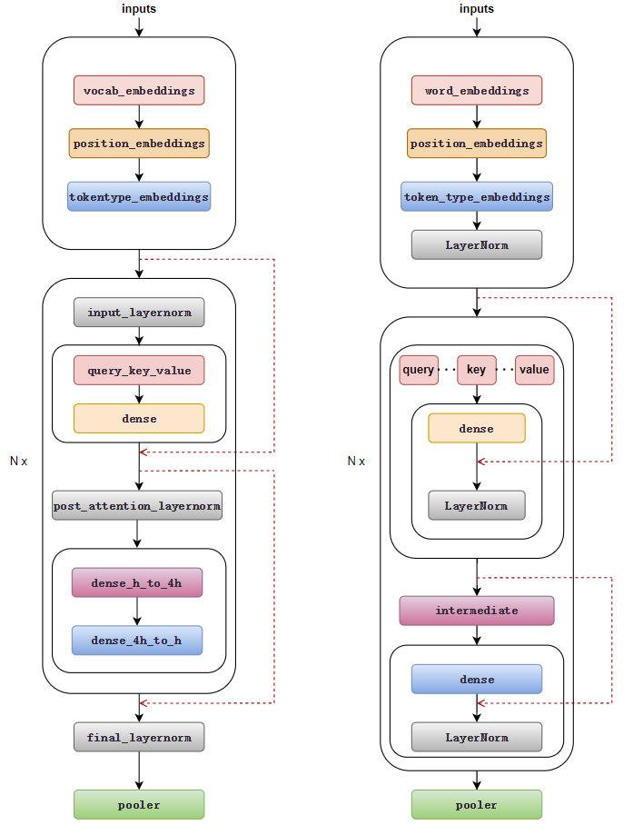

# How to impllement huggingface's weights in LiBai
Because Libai's model structure has undergone rigorous parallel mode derivation, Libai'model structure is more suitable for parallel training. Next, we introduces how to correctly load huggingface's weights with Libai model from several aspects, and takes Bert as an example.


## Model architecture difference
You can see the subtle differences in the Bert structure from the following figure (left: LiBai, right: huggingface):
- Location of layernorm: The location of layernorm is different, but the calculation order is the same.
- Shape of query, key and value: Just splice.
- Libai uses the order of the layer normalization and the residual connections of Megatron by default, relevant experiments have proved this order eliminates instabilities and also has a lower training loss. But LiBai also supports the original BERT architecture, just set `apply_residual_post_layernorm=True`.



## QKV calculation logic difference
LiBai's QKV calculation logic is difference from huggingface.
```python
# LiBai's QKV calculation logic
query_key_value = query_key_value.view(batch_size, -1, num_heads, 3 * head_size)
query_key_value = query_key_value.permute(0, 2, 1, 3)
query, key, value = flow.chunk(query_key_value, chunks=3, dim=-1)

# Huggingface's QKV calculation logic
query, key, value = flow.chunk(query_key_value, chunks=3, dim=-1)
query = query.view(query.size(0), query.size(1), num_heads, -1).permute(0, 2, 1, 3)
key = key.view(key.size(0), key.size(1), num_heads, -1).permute(0, 2, 1, 3)
value = value.view(value.size(0), value.size(1), num_heads, -1).permute(0, 2, 1, 3)
```


## QKV weight loading method
Just rearrange the weights to load correctly.
```python
import oneflow as flow
import oneflow.nn.functional as F

bsz = 32
seq_len = 5
num_heads = 12
head_size = 64
hidden_size = num_heads*head_size

x = flow.rand(bsz, seq_len, hidden_size)
weight = flow.rand(hidden_size*3, hidden_size)
bias = flow.rand(2304)

weight1 = weight.view([3, num_heads, head_size, hidden_size])
weight1 = weight1.permute(1,0,2,3).contiguous().view(3*hidden_size, hidden_size)
bias1 = bias.view(3, num_heads, head_size)
bias1 = bias1.permute(1,0,2).contiguous().view(-1)

weight2 = weight
bias2 = bias

qkv1 = F.linear(x, weight1, bias=bias1)
qkv2 = F.linear(x, weight2, bias=bias2)

# LiBai's qkv
qkv1 = qkv1.view(bsz, seq_len, num_heads, 3*head_size)
qkv1 = qkv1.permute(0, 2, 1, 3)
q1, k1, v1 = flow.chunk(qkv1, chunks=3, dim=-1)

# huggingface's qkv
q2, k2, v2 = flow.chunk(qkv2, chunks=3, dim=-1)
q2 = q2.view(q2.size(0), q2.size(1), num_heads, -1).transpose(1,2)
k2 = k2.view(k2.size(0), k2.size(1), num_heads, -1).transpose(1,2)
v2 = v2.view(v2.size(0), v2.size(1), num_heads, -1).transpose(1,2)

print((q1==q2).all())     # tensor(True)
print((k1==k2).all())     # tensor(True)
print((v1==v2).all())     # tensor(True)
```
