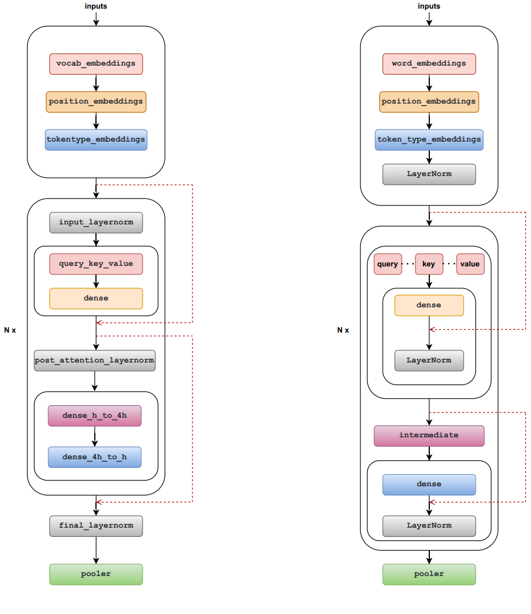

# How to use Huggingface's pretrained weights in LiBai
LiBai adopts the model structures which are more suitable for parallel training, so they are a little bit different from Huggingface's ones. In this tutorial, we introduce how to correctly load Huggingface's pretrained weights with LiBai model, let's take BERT as an example.


## LiBai Transformer vs Huggingface Transformer
You can see the subtle differences in the BERT structure from the following figure (left: LiBai, right: Huggingface):
- Location of layernorm: The location of layernorm is different, but the calculation order is the same.
- Division mode of query, key and value: Just splice.
- LiBai follows [Megatron-LM](https://github.com/NVIDIA/Megatron-LM) to use the order of the layernorm and the residual connections by default. Megatron-LM shows that this structure will eliminate instabilities and bring a lower training loss. LiBai can also support the original BERT architecture mentioned in [Paper](https://arxiv.org/pdf/1810.04805.pdf), just set `apply_residual_post_layernorm=True`.



## Difference of QKV slice logic
LiBai's QKV calculation logic is different from huggingface.
```python
# LiBai's QKV calculation logic
query_key_value = query_key_value.view(batch_size, -1, num_heads, 3 * head_size)
query_key_value = query_key_value.permute(0, 2, 1, 3)
query, key, value = flow.chunk(query_key_value, chunks=3, dim=-1)

# Huggingface's QKV calculation logic
query, key, value = flow.chunk(query_key_value, chunks=3, dim=-1)
query = query.view(query.size(0), query.size(1), num_heads, -1).permute(0, 2, 1, 3)
key = key.view(key.size(0), key.size(1), num_heads, -1).permute(0, 2, 1, 3)
value = value.view(value.size(0), value.size(1), num_heads, -1).permute(0, 2, 1, 3)
```


## QKV weight loading method
- Just rearrange the weights to load correctly. 

```python
def convert_qkv_weight(cfg, qkv_weight, qkv_bias):
    qkv_weight = qkv_weight.view([3, cfg.num_heads, cfg.head_size, cfg.hidden_size])
    qkv_weight = qkv_weight.permute(1, 0, 2, 3).contiguous().view(3*cfg.hidden_size, cfg.hidden_size)
    qkv_bias = qkv_bias.view(3, cfg.num_heads, cfg.head_size)
    qkv_bias = qkv_bias.permute(1,0,2).contiguous().view(-1)
    return qkv_weight, qkv_bias
```

- For detailed examples, please refer to [load-huggingface-bert](https://github.com/Oneflow-Inc/libai/tree/test_bert_load_huggingface_weight/projects/test_bert_load_huggingface_weight), you can verify this by running:
```bash
bash test.sh
```