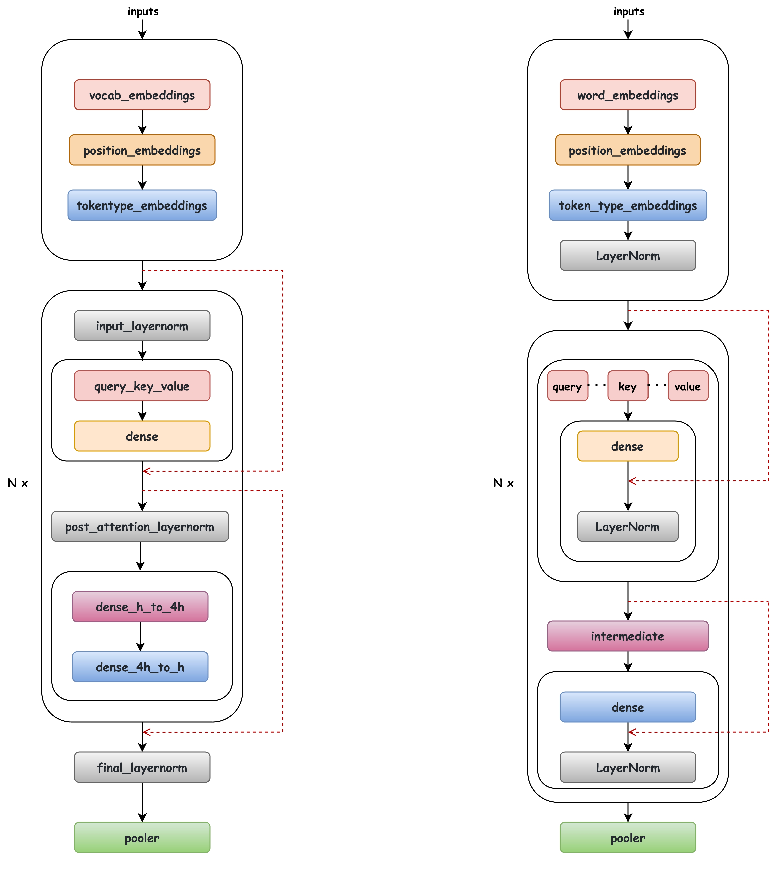

# How to use Huggingface's pretrained weights in LiBai
The built-in layers in [LiBai](https://github.com/Oneflow-Inc/libai) adopts the structure which is more suitable for parallel training, therefore the implementation in LiBai may be a little bit different from that in Huggingface. In this tutorial, we will introduce to users how to correctly load Huggingface's pretrained weights into LiBai's model. Let's take BERT as an example.


## LiBai Transformer vs Huggingface Transformer
There are subtle differences in the BERT structure as shown in the following figure (left: LiBai, right: Huggingface), which can be summarized as:
- Location of layernorm: The location of layernorm is different, but the calculation order is the same.
- A different slicing way to get the `query`, `key` and `value` matrix.
- LiBai follows [Megatron-LM](https://github.com/NVIDIA/Megatron-LM) to use the order of the layernorm and the residual connections by default. Megatron-LM shows that this structure will eliminate instabilities and bring a lower training loss. LiBai can also support the original BERT architecture mentioned in [Paper](https://arxiv.org/pdf/1810.04805.pdf) by setting `apply_residual_post_layernorm=True`.




## QKV slicing logic
LiBai's QKV slicing logic is different from that in Huggingface.
```python
# LiBai's QKV slicing logic
query_key_value = query_key_value.view(batch_size, -1, num_heads, 3 * head_size)
query_key_value = query_key_value.permute(0, 2, 1, 3)
query, key, value = flow.chunk(query_key_value, chunks=3, dim=-1)

# Huggingface's QKV slicing logic
query, key, value = flow.chunk(query_key_value, chunks=3, dim=-1)
query = query.view(query.size(0), query.size(1), num_heads, -1).permute(0, 2, 1, 3)
key = key.view(key.size(0), key.size(1), num_heads, -1).permute(0, 2, 1, 3)
value = value.view(value.size(0), value.size(1), num_heads, -1).permute(0, 2, 1, 3)
```


## How to correctly load QKV weights
- To correctly load Huggingface's transformer weights, you only need to rearrange the loaded weights as follows:

```python
def convert_qkv_weight(cfg, qkv_weight, qkv_bias):
    qkv_weight = qkv_weight.view([3, cfg.num_heads, cfg.head_size, cfg.hidden_size])
    qkv_weight = qkv_weight.permute(1, 0, 2, 3).contiguous().view(3*cfg.hidden_size, cfg.hidden_size)
    qkv_bias = qkv_bias.view(3, cfg.num_heads, cfg.head_size)
    qkv_bias = qkv_bias.permute(1,0,2).contiguous().view(-1)
    return qkv_weight, qkv_bias
```

- For detailed examples, please refer to [load-huggingface-bert](https://github.com/Oneflow-Inc/libai/tree/test_bert_load_huggingface_weight/projects/test_bert_load_huggingface_weight). You can verify this by running:
```bash
bash test.sh
```