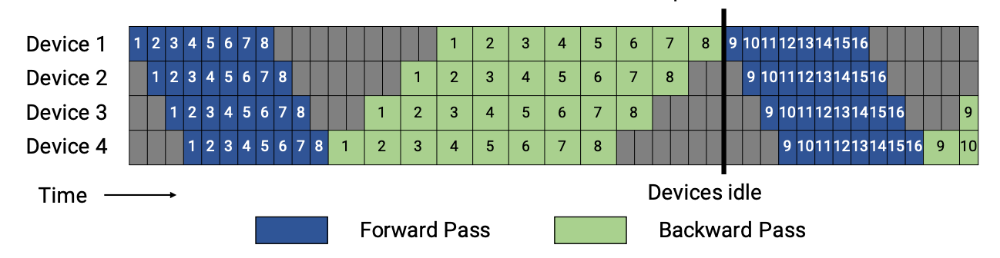
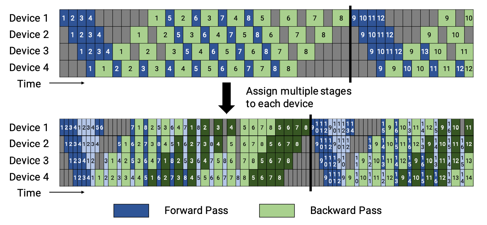

# How to Customize Parallelism

Common parallelisms have already been implemented in LiBai, such as data parallel, tensor parallel and pipeline parallel. But there is also a need for user customized parallel. In this tutorial, we will show you how to customize your own parallelism.

## Define your own Parallel Model with LiBai.layers

### Large-scale FC

Suppose you have a huge fully-connected-layer for large-scale classification (e.g., 1000w classes), which makes it impossible to fit into a single GPU.

Don't worry, with the help of `LiBai.layers`, you can write models in a familiar way that you used to write for a single GPU. Here is a simple example showing how to write a tensor-parallel fully-connected-layer with 2 GPUs.

```python
# huge_fc_example.py
import oneflow as flow
from omegaconf import DictConfig
from oneflow import nn

from libai.layers import Linear
from libai.utils import distributed as dist

cfg = DictConfig(dict(data_parallel_size=1, tensor_parallel_size=2, pipeline_parallel_size=1))
dist.setup_dist_util(cfg)


class Huge_FC(nn.Module):
    def __init__(self):
        super().__init__()
        self.fc = Linear(2048, 32768, parallel="col")

    def forward(self, x):
        return self.fc(x)


huge_fc = Huge_FC()

x = flow.rand(32, 2048, sbp=flow.sbp.broadcast, placement=flow.placement("cuda", ranks=[0, 1]))
y = huge_fc(x)

print(f"rank: {flow.env.get_rank()}, tensor shape: {y.to_local().shape}")
```

You can run this toy example with command line as follows:

```shell
python3 -m oneflow.distributed.launch --nproc_per_node 2 huge_fc_example.py

>> rank: 0, tensor shape: oneflow.Size([32, 16384])
>> rank: 1, tensor shape: oneflow.Size([32, 16384])
```

In the result, you can find that `y` has been split along with `axis=1` on 2 GPUs.

### Large MLP models

Suppose you have a huge MLP model which is very popular in transformer-based models, with a huge hidden size that makes it difficult to fit into a single GPU.

You can then split the model weights across GPUs in a hybrid parallel mode while you can still write your model in a familiar way.

Here is a simple example about the 2D parallel MLP in the LiBai context.

```python
import oneflow as flow
from omegaconf import DictConfig
from oneflow import nn

from libai.layers import Linear
from libai.utils import distributed as dist

cfg = DictConfig(dict(data_parallel_size=2, tensor_parallel_size=2, pipeline_parallel_size=1))
dist.setup_dist_util(cfg)

# Write a Simple 2D Parallel MLP
class MLP_2D(nn.Module):
    def __init__(self):
        super().__init__()
        self.linear_1 = Linear(in_features=1024, out_features=16384, parallel="col")
        self.relu = nn.GELU()
        self.linear_2 = Linear(in_features=16384, out_features=1024, parallel="row")

    def forward(self, x):
        x = self.linear_1(x)
        x = self.relu(x)
        x = self.linear_2(x)
        return x

# define a model
mlp = MLP_2D()

# define input with 2D sbp
x = flow.rand(
    32,
    1024,
    sbp=dist.get_nd_sbp([flow.sbp.split(0), flow.sbp.broadcast]),
    placement=dist.get_layer_placement(0)
)
y = mlp(x)

print(f"rank: {flow.env.get_rank()}, tensor shape: {y.to_local().shape}")
```

You can run it with command line as follows:

```shell
python3 -m oneflow.distributed.launch --nproc_per_node 4 huge_mlp_example.py

>> rank: 2, tensor shape: oneflow.Size([16, 1024])
>> rank: 3, tensor shape: oneflow.Size([16, 1024])
>> rank: 1, tensor shape: oneflow.Size([16, 1024])
>> rank: 0, tensor shape: oneflow.Size([16, 1024])
```

From above, you can see that the data are split into 2 groups for data parallel, and weights are split into 2 groups for tensor model parallel. So this simple example just implements a 2D parallel.

For your convenience, we provide some prevalent models such as BERT, GPT-2, and ViT in Mode Zoo. Feel free to customize them into different sizes to fit into your special needs.

## Write your own Pipeline Parallel Model

This tutorial describes how to use pipeline parallel in your own model. LiBai has two pipeline-parallel modes: naive pipeline parallel and (similar) 1F1B pipeline parallel introduced by [Megatron-LM](https://arxiv.org/abs/1909.08053).

### Introduction of Naive Pipeline Parallel

In LiBai, naive pipeline parallel can be implemented by setting layers and parameters `placement`. 
You can easily configure their `placement` by `dist.get_layer_placement(idx)`.

Here is an example for `placement` configuration.

```python
# set a free tensor placement to first stage
self.pos_embed = nn.Parameter(
    flow.zeros(
        1,
        num_patches + 1,
        embed_dim,
        sbp=dist.get_nd_sbp([flow.sbp.broadcast, flow.sbp.broadcast]),
        placement=dist.get_layer_placement(0),
    )
)

# set a Linear placement to last stage
# set it manually 
self.head = Linear(embed_dim, num_classes, layer_idx=-1).to_global(placement=dist.get_layer_placement(-1))
# use `layer_idx` API
self.head = Linear(embed_dim, num_classes, layer_idx=-1)
```

After configuring models placement, add the input placement transition across different stages. LiBai sets a `layer_idx` attribute in each `nn.Module`, so you can simply add `to_global` in `forward` to implement input placement transition.

```python
class MyModule(nn.Module):
    def __init__(self, ... *, layer_idx):
        ...
        self.layer_idx = layer_idx
        ...

    def forward(self, hidden_states):
        hidden_states = hidden_states.to_global(placement=dist.get_layer_placement(self.layer_idx))
        ...
```

After configuring models and data placement, you only need to set the distributed configuration before training.

```python
# set pipeline stages to 2
train.dist.pipeline_parallel_size = 2

# set model layers for pipeline
train.dist.pipeline_num_layers = hidden_layers
```

### Introduction of 1F1B Pipeline Parallel

First, we will introduce GPipe to you to get a better understanding of pipeline parallelism. In GPipe, when the forward passes of all microbatches finish, the backward passes would be executed (as shown in below).



1F1B performs one forward pass followed by one backward pass. Finally, at the end of a batch, complete backward passes for all remaining in-flight microbatches. In general, 1F1B is more efficient than GPipe.

There are two schedules of 1F1B pipeline: the non-interleaved and the interleaved. The figures are shown below. 



In LiBai, the non-interleaved schedule is supported currently, and this mode is more memory-efficient than GPipe.

You only need to set models stage id except that placement configuration in naive pipeline parallel, and stage id can help create stashed buffers for activation.

This example shows how to configure bert model stage id:

```python
class BertForPreTraining(nn.Module):
    def __init__(self, ...):
        ...
    def forward(self, ...):
        ...
    
    @staticmethod
    def set_pipeline_stage_id(model):
        dist_utils = dist.get_dist_util()
                                                                                                     
        # Set pipeline parallelism stage_id
        for module_block in model.modules():
            # module.origin can get the original module
            if isinstance(module_block.origin, BertEmbeddings):
                module_block.config.stage_id = dist_utils.get_layer_stage_id(0)
            elif isinstance(module_block.origin, BertExtendedAttnMask):
                module_block.config.stage_id = dist_utils.get_layer_stage_id(0)
            elif isinstance(module_block.origin, TransformerLayer):
                module_block.config.stage_id = dist_utils.get_layer_stage_id(module_block.layer_idx)
            elif isinstance(module_block.origin, BertPooler):
                module_block.config.stage_id = dist_utils.get_layer_stage_id(-1)
            elif isinstance(module_block.origin, BertPreTrainingHeads):
                module_block.config.stage_id = dist_utils.get_layer_stage_id(-1)
                                                                                                     
        # Set the last layernorm stage id
        model.bert.final_layernorm.config.stage_id = dist_utils.get_layer_stage_id(-1)
```

In `set_pipeline_stage_id`, `BertEmbeddings` and `BertExtendedAttnMask` are placed in the first stage, then each `TransformerLayer` is uniformly placed in each stages. At last, place `BertPooler` and `BertPreTrainingHeads` in the last stage. But don't forget to place the last `layernorm` in `BertEncoder` which does not belong to any `TransformerLayer` in the last stage.

After adding the `set_pipeline_stage_id` function in a pre-defined `nn.Module`, `GraphBase` will invoke it automatically as below:

```python
def set_pipeline_stage_id(self):
    if hasattr(type(self.model.origin), "set_pipeline_stage_id"):
        type(self.model.origin).set_pipeline_stage_id(self.model)
```

The last thing left is to set the training configuration as below:

```python
# set pipeline stages to 2
train.dist.pipeline_parallel_size = 2

# set model layers for pipeline
train.dist.pipeline_num_layers = hidden_layers

# enable activation checkpointing
train.activation_checkpoint.enabled = True

# enable gradient accumulation with 8 micro-batches
train.num_accumulation_steps = 8
```
